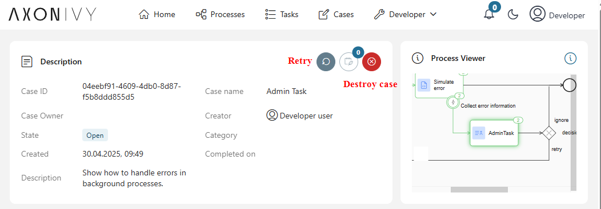
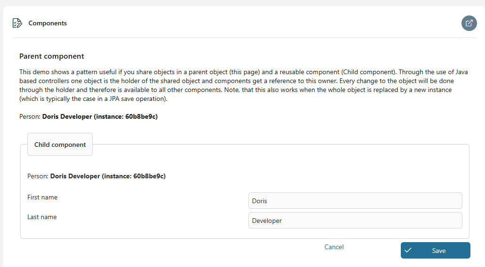
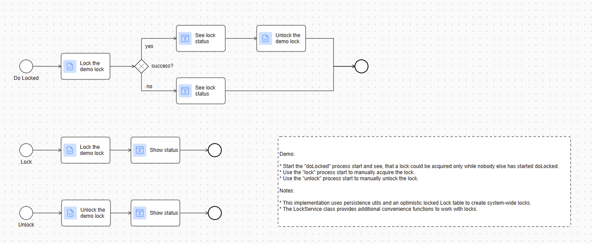
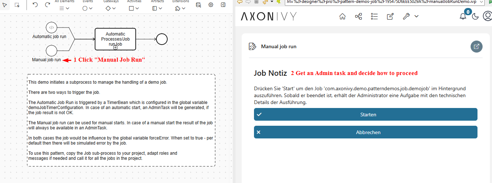
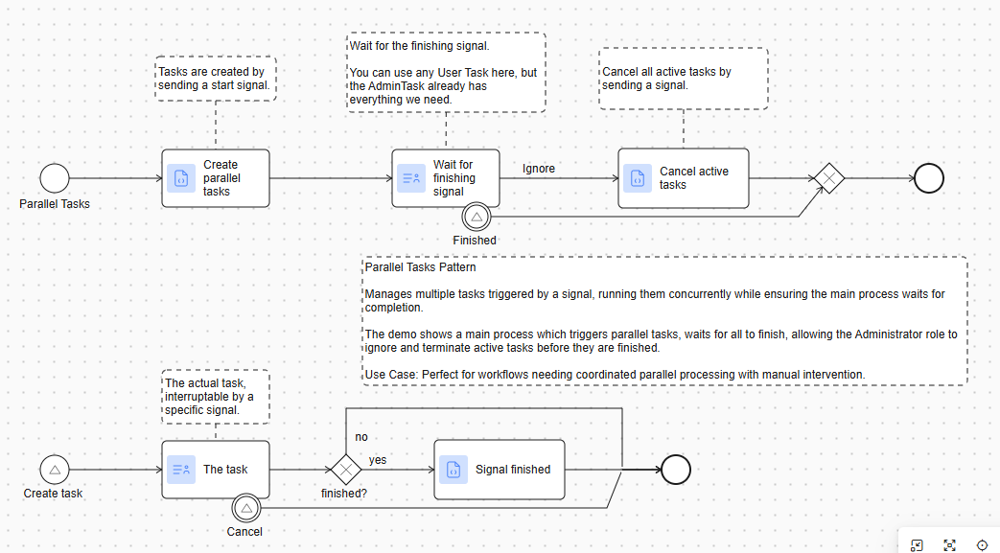
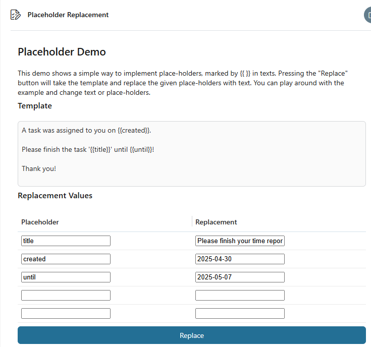
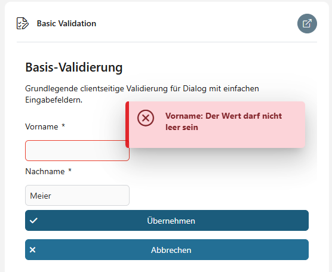
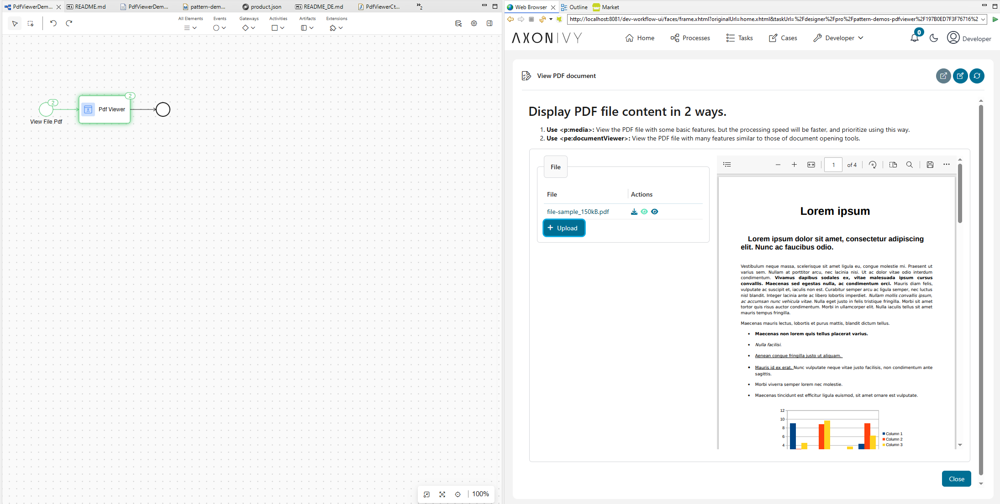
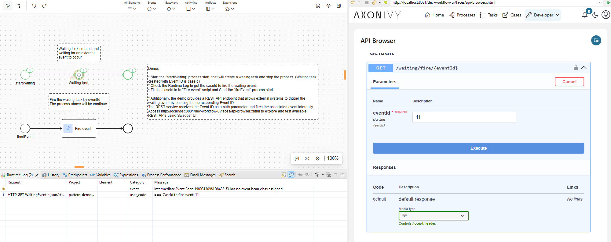

# Pattern Demos

Pattern Demos are a collection of processes, dialogs, code, and other snippets that have proven useful in our projects and are shared publicly as best practices through this Market Extension.  
To use a pattern, copy the necessary parts into your project and adapt them as needed. While the demos are kept as simple as possible, some may require additional infrastructure in your project.

In detail, you will find solutions to the following typical problems:  
- **Admintask**: In case of errors in the process execution an admin gets a task and can decide how to proceed.
- **Component**: This demo shows how different parts of a user interface can easily share and update the same data by connecting through a common controller, ensuring changes are always in sync.
- **Lock**: Prevents multiple executions of a task
- **Job**: This pattern helps you manage automated backend jobs in Axon Ivy, with options to start them manually and handle errors through admin tasks—making jobs easier to control, monitor, and recover from failures.
- **Paralleltasks**: This pattern helps manage multiple tasks running at the same time.
- **Placeholder**: Replace placeholders in text (like `{{name}}`) with real values using a built-in service.
- **Primefaceextension**: Use these examples to see how Primefaces Widgets can be customized using the Primefaces client-side API of widgets.
- **Validation**: Ensures user input is correct by checking required fields, valid values, and field combinations.
- **ZIP**: This demo shows an example of how to use the zip feature.
- **PDFViewer**: This demo shows how to upload and view PDF file.
- **Waiting Event**: This demo shows how can interrupt a process execution and continue when an external event to occur.

## Demo

### Admin Task

Use an Admin Task to catch errors in unattended backend-jobs. In case of errors,
an admin role gets a task with the results and can decide whether the job should be retried or skipped.

This demo creates a **background process** run by the system that intentionally triggers an error. The error is displayed in an **AdminTask**, where an administrator can choose to **retry** the process or **ignore** the error. Before retrying, the issue should be resolved manually. In this demo, the "error" can be fixed by setting the global variable `forceError` to `false` and then retrying.

You can **reuse the dialog** in your own project and follow this pattern whenever you need to execute background functionality and want to handle errors visibly.

> **Note:** Make sure the `persist` flag is set for the parameters `task` and `detail`, so they remain available when the administrator opens the task!

### Components

This demo shows a pattern to allow referencing a parent owned object in one or more child components.  
It uses Java based controllers which offer more flexibility than Ivy processes in complex UI scenarios.

One object (in this example the `ParentCtrl`) owns a business object and implements a specific holder interface (in this example
the `PersonHolder`) which allows getting and setting of the `Person` business object. Other controllers are created by the
`ParentCtrl` and get a reference to the `ParentCtrl` (who is the `PersonHolder`). Therefore both controllers have access to the
`Person`. This way a change in the component will automatically be reflected in the parent as well and vice versa. Note, that the
automatic update will work even when a new instance of the `Person` is set by any component.

Java controllers and similar patterns can be used for many complex situations (e.g. inheritance).

### Lock

Use the LockService class to acquire system-wide locks for single-use actions. The LockService
is based on persistence-utils and needs a database connection. It saves locks in an optimistic
locked entity to avoid race-conditions. 

### Job

Use this job pattern for all your unattended backend jobs to make them startable manually and in case of manual
start or errors, create an admin task to let the admin role decide how to continue.

The Job Pattern demonstrates a flexible and reusable approach to scheduling and managing periodic tasks within Axon Ivy.
This pattern initiates a subprocess to handle a demo job, offering two distinct methods to trigger execution, along with
robust error handling via the AdminTask concept.

The included demo showcases a typical scenario for the Job Pattern. It illustrates how the job is triggered (via scheduler or dialog),
how a failure is simulated (using `forceError`), and how the AdminTask enables handling of that failure with options like "Retry" and "Ignore."
Use this as a starting point to explore and customize the pattern for your needs.

Note, that this pattern makes use of the `pattern-demos-lock` and the `pattern-demos-admintask` patterns.

#### Triggering the Job

- **Scheduled Triggering:** The job can be automatically activated using a TimerBean. This is configured through the global variable `demoJobTimerConfiguration` (e.g., `0 0 * * *` for daily execution at midnight).
- **Manual Triggering:** Alternatively, the job can be started manually via a user dialog. This method provides on-demand flexibility, allowing users to initiate the job whenever necessary.

#### Job Behavior and Error Simulation

The execution of the job — whether scheduled or manual — is influenced by the `forceError` variable in `variables.yaml`.
Set the variable to `true`, to cause the job to simulate an error. This feature is particularly useful for testing the
pattern’s error handling capabilities. To observe successful execution, set `forceError` to `false`.

#### Error Handling with AdminTask

When the job fails—either due to a simulated error or an actual issue—an AdminTask is created to manage the situation.
Assigned to the Administrator role and categorized as ADMIN, this task provides a framework for administrator intervention.
The available actions include:

- **Retry:** Reattempt the job to achieve successful completion.
- **Ignore:** Dismiss the failure, allowing the next scheduled instance (if applicable) to proceed as planned.
- **Check Later:** Postpone the decision by canceling out of the task, keeping it open for later review.

These options are conceptual and must be tailored to your specific process. Refer to the "Admin Task" section under "Setup" for more details on customizing the AdminTask for your needs.

#### Additional Features

##### ServiceResult

The pattern also offers a class `ServiceResult` which can be used to collect multiple results which are often the case in
regular jobs. Use this class in your job-implementation to generate `OK`, `WARNING` and `ERROR` messages. The Job pattern shown
here will automatically generate an Admin Task if a `ServiceResult` contains any not OK entry.

##### Job Locking

Typically jobs will be started locked without timeout using the `pattern-demos-lock` pattern. This means, that only one instance of
a job can be running at a point in time and locks will never timeout.

##### Job Description

To avoid providing many parameters for a Job start, a `JobDescription` can be built and put into a
job repository as shown in this demo. Note, that running jobs by the name of their `JobDescription`
will only work, after the `JobDescription` is added to the repository. This can be done in multiple
ways (StartEventBean, static functions,...) and the demo shows a simple example using static
initialization.

### Parallel Tasks

The parallel tasks pattern is designed to manage a dynamic number of concurrent tasks. The task group is assigned
a unique id and the individual tasks are started by a signal. The unique id is later used to signal the end of
all tasks and/or to cancel tasks if the administrator decides.

The included demo illustrates a practical use case:

* A main process creates a unique id for the task group and sends a signal to trigger several parallel tasks.
* These tasks execute concurrently, simulating real-world workloads.
* The main process waits for all tasks to finish or allows an admin to skip stalled tasks via an admin task interface.

In this demo, every task notifies it's "FINISHED" status directly in a task custom field. When a task is
finished, it checks whether all other tasks are finished as well by simply counting the number of tasks
in the current group. In real word scenarios, business objects might represent the total finished state
or more complex handling after finishing might be required (e.g. canceling of tasks because of a business
condition) and therefore the pattern needs to be adapted to your requirements.

### Placeholder Evaluation

Use this basic ReplacementService directly in your project or just as a start to implement your own
text-based place-holder replacement.

After clicking "Replace" the following text has been generated:

Notes:

* Ivy allows the use of placeholders or script output already in certain elements.
* DocFactory and Aspose implement mergefields or mustache placeholders in Word files.
* Existing Java-based placeholder libraries can be added to an Ivy project.

### Primefaces Extensions

Use these examples to see how Primefaces Widgets can be customized using the Primefaces client-side API of widgets.
This demonstration illustrates how to enhance the functionality of the PrimeFaces InputText widget in two ways: by refining the logic of its existing methods and by introducing new methods to the widget.

### Validation

The validation pattern shows some typical validation scenarios for

* a simple field required validation
* a field value validation
* a multi-field validation with model mapping and server side logic

  Basic validation:  
  

#### Managed beans

The managed bean `messages` is used as an elegant way to re-use custom CMS messages for multiple fields.
The managed bean `constants` is used as an elegant way to re-use project constants in the code and in the UI.

### Zip Demo

This demo shows an example of how to use the zip feature. 

You can upload files from your computer. They will be processed and automatically added to an existing zip file. If no ZIP file exists, a new one will be created.  
Click the Download button to download the ZIP file containing all the files you uploaded.  
You can also click "Unpack" to extract all the files to your local Designer folder.  

### PDF Viewer Demo

The uploaded documents are stored in the memory and displayed in a table.
In case it's downloaded or displayed, the PDF content is streamed to the corresponding PrimeFaces component.

To display the PDF, two different components are demonstrated:
* Document Viewer
* Media

The Document Viewer component is available as a PrimeFaces extension, whereas the Media feature is included in the main PrimeFaces package. The features and UX of both components are different.
Prioritize using Media over Document Viewer, because Media executes faster. In cases where you want to use more features, such as editing documents, then use Document Viewer.

  PDF Viewer Demo:

### Waiting Event

This module demonstrates a technical pattern for handling asynchronous process continuation using intermediate events.
It includes two primary process entries: **startWaiting**, which initiates a process and suspends it at a defined wait state, and **fireEvent**, which triggers the continuation by referencing a specific **Event ID**—typically aligned with the process **caseId**.

In addition to internal invocation, the demo exposes a RESTful endpoint (/waiting/fire/{eventId}) that enables external systems or services to resume suspended processes by issuing a simple HTTP GET request. This is particularly useful in integration scenarios where the process must wait for a callback, external system response, or event-driven signal.

The solution is lightweight, stateless, and easily adaptable to various business requirements.

## Setup

This component is a repository for valuable patterns and demos. Typically they must be adapted to your
project situation. Please copy and adapt the pattens and examples that you want to use directly to your project.

### Admin Task

The AdminTask shows a concept and must be adapted to your needs and usage-places because it depends on your
process. The available buttons can be selected on a case-by-case base and you must think what a "Retry"
or an "Ignore" would mean in your context or if you decide to allow these buttons it all. Out of the box, the
AdminTask handled "Check Later" by itself (by just canceling out of the task). To use the AdminTask in
your projects, copy the Dialog to your project, adjust it to your needs and use it at all background
activities that could fail and require Administrator attention. The demo shows a typical situation and
a simple example of handling "Retry" and "Ignore".

Note, that the task and details parameter of the AdminTask should be persistent (i.e. have the persistent
flag set in your data-class). This is necessary so that the values will be available, when the Admin opens
the task later.

The demo assignes the task to the role Administrator and categorizes the task as the ADMIN category.
Change it to your needs.

### Primefaces Extensions 

This demonstration illustrates how to enhance the functionality of the PrimeFaces InputText widget in two ways:

* refining the logic of existing methods
* introducing new widget methods

If you would like to extend or improve the functionality of a Primefaces component, follow these steps:

* Create an extension Javascript at <PROJECT>/webContent/js/MyExtension.js
* Use the Client API documentation of Primefaces.
* In your pages add a link to your JavaScript:
        <h:outputScript name="js/MyExtension.js"/>

If you want to directly replace behaviour of existing widgets, you have to find first the original Javascript code of your widget:

* Find the currently used Primefaces library. You should find it at <DESIGNER>/webapps/ivy/WEB-INF/lib/primefaces...jar
* Unpack this jar file (it is a zip file), and find the original javascript source of the component you want to change (typically at <JAR>/META-INF/resources/primefaces)

***Note***: If you modify the logic of a component, you should verify its functionality with each Ivy update, as these updates often include PrimeFaces updates that could result in compatibility issues.

